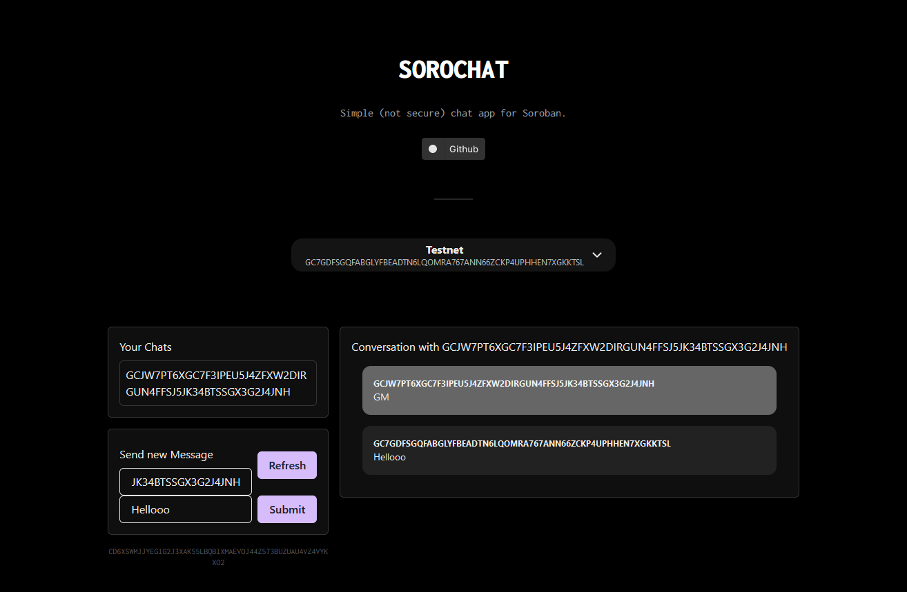

# SOROCHAT dapp tutorial

[SOROCHAT](https://github.com/benjaminsalon/sorochat) is a nice little messaging dapp built using create-soroban-dapp for demonstration purpose. 

[LIVE VERSION HERE 🕺](https://sorochat.vercel.app/)

Submitted and awarded for the [Sorobounties 2024](https://github.com/stellar/sorobounties/discussions/8).

## Tutorial on Dev.to

You can find a written [tutorial](https://dev.to/benjaminsalon/sorochat-how-to-build-a-simple-chat-dapp-using-create-soroban-dapp-295l) explaining how to create the dapp on dev.to 🚀